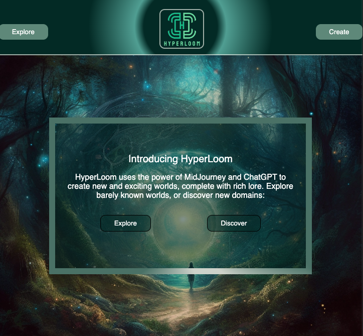
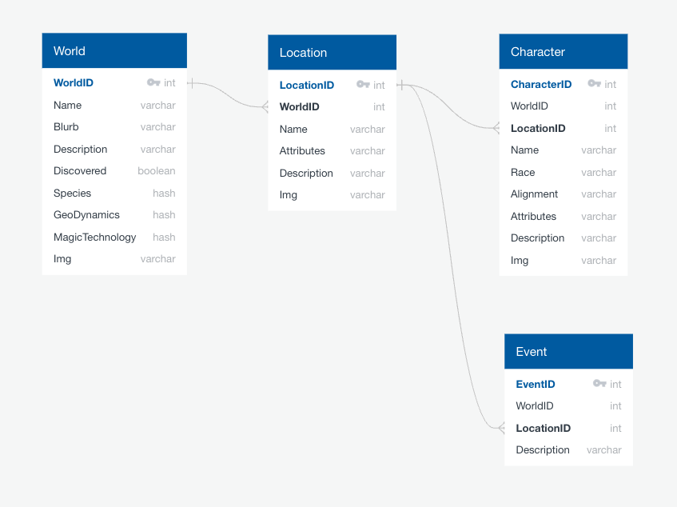
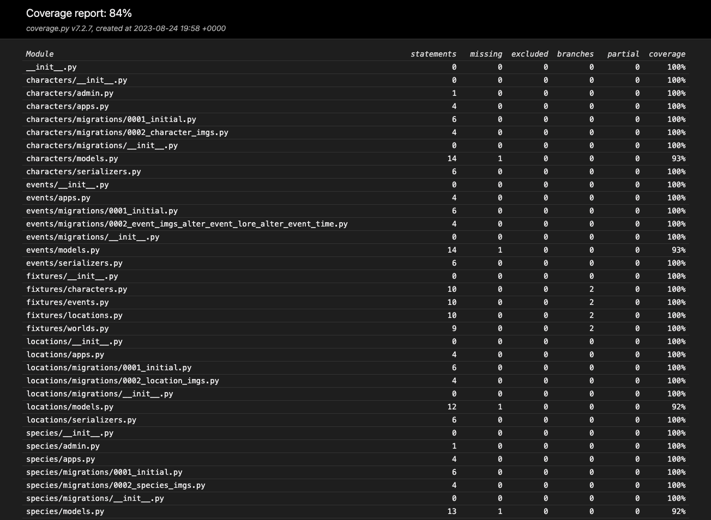
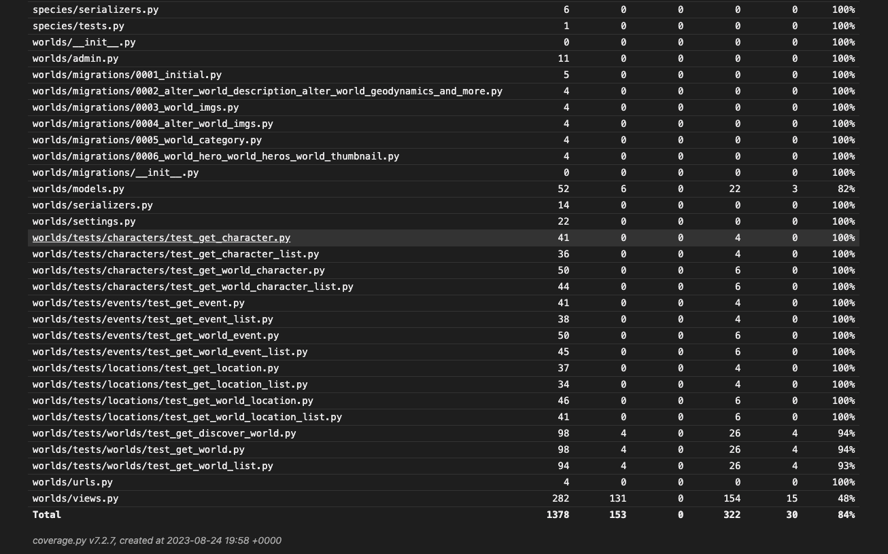

<!-- Improved compatibility of back to top link: See: https://github.com/othneildrew/Best-README-Template/pull/73 -->
<a name="readme-top"></a>
<!--
*** Thanks for checking out the Best-README-Template. If you have a suggestion
*** that would make this better, please fork the repo and create a pull request
*** or simply open an issue with the tag "enhancement".
*** Don't forget to give the project a star!
*** Thanks again! Now go create something AMAZING! :D
-->

<!-- PROJECT SHIELDS -->
<!--
*** I'm using markdown "reference style" links for readability.
*** Reference links are enclosed in brackets [ ] instead of parentheses ( ).
*** See the bottom of this document for the declaration of the reference variables
*** for contributors-url, forks-url, etc. This is an optional, concise syntax you may use.
*** https://www.markdownguide.org/basic-syntax/#reference-style-links
-->
[![Contributors][contributors-shield]][contributors-url]
[![Forks][forks-shield]][forks-url]
[![Stargazers][stars-shield]][stars-url]
[![Issues][issues-shield]][issues-url]
[![MIT License][license-shield]][license-url]

<!-- PROJECT LOGO -->
<br />
<div align="center">
  <a href="https://github.com/The-Never-Ending-Story/back-end">
    
  </a>

<h3 align="center">HyperLoom</h3>

  <p align="center">
    <a href="https://hyper-loom-explorer.vercel.app">Deployed Front end</a>
    ·
    <a href="https://hyperloom-d209dae18b26.herokuapp.com/worlds">Deployed Back end</a>
    ·
    <a href="https://github.com/The-Never-Ending-Story/back-end/issues">Report Bug</a>
    ·
    <a href="https://github.com/The-Never-Ending-Story/back-end/issues">Request Feature</a>
  </p>
</div>

<!-- TABLE OF CONTENTS -->
<details>
  <summary>Table of Contents</summary>
  <ol>
    <li>
      <a href="#about-the-project">About The Project</a>
      <ul>
        <li><a href="#built-with">Built With</a></li>
      </ul>
    </li>
    <li>
      <a href="#getting-started">Getting Started</a>
      <ul>
        <li><a href="#prerequisites">Prerequisites</a></li>
        <li><a href="#installation">Installation</a></li>
        <li><a href="#additional-instructions">Additional Instructions</a></li>
      </ul>
    </li>
    <li><a href="#database-schema">Database Schema</a></li>
    <li><a href="#endpoints">Endpoints</a></li>
    <li><a href="#testing">Testing</a></li>
    <li><a href="#license">License</a></li>
    <li><a href="#contact">Contact</a></li>
  </ol>
</details>

<!-- ABOUT THE PROJECT -->
## About The Project



Hyperloom is a web based application that leverages ChatGPT and Midjourney to provide users new & expansive fictional worlds. Users are able to browse previously generated worlds or create new ones with the click of a button. Hyperloom aims to foster the imagination and excitement of its users while providing them with high resolution images to give the sense of an immersive experience.

Hyperloom was built with a separate frontend and backend. The backend API service exposes RESTful endpoints returning JSON data for the frontend to consume. The backend seeds its database using a script for generating textual descriptions of worlds via the ChatGPT API. The ChatGPT API creates the AI-generated textual metadata for an imaginary world. This metadata is then also used to create the prompt that is sent to the Midjourney API to create AI-generated images based off of those descriptions.

- [Production Website][deployed-frontend-url]
- [Backend API Service (/worlds endpoint)][deployed-backend-url]
- [Hyperloom GitHub][hyperloom-gh-url]
- [Frontend Repository][frontend-gh-url]
- [Backend Repository][backend-gh-url]

<p align="right">(<a href="#readme-top">back to top</a>)</p>

### Built With

- [![Python][python-shield]][python-url]
- [![Django][django-shield]][django-url]
- [![Django Rest Framework][django-rest-framework-shield]][django-rest-framework-url]
- [![Pytest][pytest-shield]][pytest-url]
- [![SQLite][sqlite-shield]][sqlite-url]
- [![GitHub Actions][github-actions-shield]][github-actions-url]
- [![Heroku][heroku-shield]][heroku-url]

#### Integrations

- [![OpenAI API][open-ai-api-shield]][open-ai-api-url]
- [![Midjourney API][midjourney-api-shield]][midjourney-api-url]

<p align="right">(<a href="#readme-top">back to top</a>)</p>

<!-- GETTING STARTED -->
## Getting Started

To get a local copy of Hyperloom up and running, follow these simple example steps for the backend.

These instructions are only for the backend. To setup the frontend locally, follow the instructions in the [frontend repository's][frontend-gh-url] `README.md` file.

### Prerequisites

- [Python v3.11.4](python.org)
- [PIP](https://pypi.org/project/pip/)

### Installation

1. Create a virtual environment
   ```sh
   python -m venv hyperloom
   ```
2. Activate the virtual environment
   ```sh
   source hyperloom/bin/activate
   ```
3. Clone the repo inside the virtual environment directory
   ```sh
   git clone https://github.com/The-Never-Ending_Story/back-end.git
   ```
4. Install python packages from requirements.txt
   ```sh
   python -m pip install -r requirements.txt
   ```
5. Make migrations
   ```sh
   python manage.py makemigrations
   ```
6. Run migrations
   ```sh
   python manage.py migrate
   ```
7. Create an admin super user with your own username and password
   ```sh
   python manage.py createsuperuser
   ```
8. Run the server
   ```sh
   python manage.py runserver
   ```
9. Visit http://localhost:8000

### Additional Instructions

10. [Get a OpenAI API key][open-ai-api-url]
11. [Get a Midjourney API key][midjourney-api-url]
12. Create .env file and setup environment variables for both the OpenAI API key and the Midjourney API key
   ```sh
   # .env file
   OPENAI_API_KEY = <YOUR OPENAI API KEY>
   MIDJ_API_KEY = <YOUR MIDJOURNEY API KEY>
   ```
13. Run the script for the world generator service
   ```sh
   python services/world_generator.py
   ```
14. [Deploy to Heroku](https://devcenter.heroku.com/articles/deploying-python)

<p align="right">(<a href="#readme-top">back to top</a>)</p>

## Database Schema



## Endpoints

Prefix all endpoints with the deployed backend API domain: [https://hyperloom-d209dae18b26.herokuapp.com][deployed-backend-url]

API documentation is done using [Swagger](https://swagger.io/) (linked below), following the [OpenAPI Specification](https://github.com/OAI/OpenAPI-Specification) from the [OpenAPI Initiative](https://www.openapis.org/). API responses return JSON.

[Hyperloom API Documentation in Swagger](https://app.swaggerhub.com/apis-docs/brandenge/Hyperloom/1.1.1)

## Testing

To run the Pytest test suite, follow the following steps:

1. Activate your virtual environment
2. Navigate to the application root directory where the `pytest.ini` file is
3. Run:
    ```sh
    pytest
    ```
4. Open the Pytest coverage report with:
   ```sh
   open htmlcov/index.html
   ```

Use the built-in Python Debugger (PDB) for debugging by adding the following line of code to set a breakpoint:
          a
```python
import pdb;pdb.set_trace()
```

Coverage report:




<!-- ROADMAP -->
## Roadmap

Potential features, functionality, or refactors for the future:

- Add a background worker to Heroku to continuously run the world generator script to generate and seed more data in the database
- Additional tests for endpoints
- User features to save and share favorite worlds
- Search features to find worlds

<!-- LICENSE -->
## License

Distributed under the MIT License. See `LICENSE.txt` for more information.

<p align="right">(<a href="#readme-top">back to top</a>)</p>

<!-- CONTACT -->
## Contact

- Andrew Bowman: [![LinkedIn][linkedin-shield]][andrew-li-url] [![GitHub][github-shield]][andrew-gh-url]
- Sean Cowans: [![LinkedIn][linkedin-shield]][sean-li-url] [![GitHub][github-shield]][sean-gh-url]
- Branden Ge: [![LinkedIn][linkedin-shield]][branden-li-url] [![GitHub][github-shield]][branden-gh-url]

Special thanks to Brian Zanti, our instructor and project manager

<p align="right">(<a href="#readme-top">back to top</a>)</p>

<!-- MARKDOWN LINKS & IMAGES -->
<!-- https://www.markdownguide.org/basic-syntax/#reference-style-links -->
[contributors-shield]: https://img.shields.io/github/contributors/The-Never-Ending-Story/back-end.svg?style=for-the-badge
[contributors-url]: https://github.com/The-Never-Ending-Story/back-end/graphs/contributors
[forks-shield]: https://img.shields.io/github/forks/The-Never-Ending-Story/back-end.svg?style=for-the-badge
[forks-url]: https://github.com/The-Never-Ending-Story/back-end/network/members
[stars-shield]: https://img.shields.io/github/stars/The-Never-Ending-Story/back-end.svg?style=for-the-badge
[stars-url]: https://github.com/The-Never-Ending-Story/back-end/stargazers
[issues-shield]: https://img.shields.io/github/issues/The-Never-Ending-Story/back-end.svg?style=for-the-badge
[issues-url]: https://github.com/The-Never-Ending-Story/back-end/issues
[license-shield]: https://img.shields.io/github/license/The-Never-Ending-Story/back-end.svg?style=for-the-badge
[license-url]: https://github.com/The-Never-Ending-Story/back-end/blob/main/LICENSE.txt

[python-shield]: https://img.shields.io/badge/Python-3776AB?style=for-the-badge&logo=python&logoColor=white
[python-url]: https://www.python.org

[django-shield]: https://img.shields.io/badge/Django-092E20?style=for-the-badge&logo=django&logoColor=white
[django-url]: https://www.djangoproject.com

[django-rest-framework-shield]: https://img.shields.io/badge/Django_Rest_Framework-540303?style=for-the-badge&logo=django&logoColor=white
[django-rest-framework-url]: https://www.django-rest-framework.org

[pytest-shield]: https://img.shields.io/badge/Pytest-0A9EDC?style=for-the-badge&logo=pytest&logoColor=white
[pytest-url]: https://docs.pytest.org

[sqlite-shield]: https://img.shields.io/badge/SQLite-003B57?style=for-the-badge&logo=sqlite&logoColor=white
[sqlite-url]: https://www.sqlite.org

[github-actions-shield]: https://img.shields.io/badge/GitHub_Actions-2088FF?style=for-the-badge&logo=githubactions&logoColor=white
[github-actions-url]: https://github.com/features/actions

[open-ai-api-shield]: https://img.shields.io/badge/OpenAI_API-412991?style=for-the-badge&logo=openai&logoColor=white
[open-ai-api-url]: https://openai.com/blog/openai-api

[midjourney-api-shield]: https://img.shields.io/badge/Midjourney_API-061434?style=for-the-badge&logoColor=white
[midjourney-api-url]: https://www.midjourney.com

[heroku-shield]: https://img.shields.io/badge/Heroku-430098?style=for-the-badge&logo=heroku&logoColor=white
[heroku-url]: https://www.heroku.com

[hyperloom-gh-url]: https://github.com/The-Never-Ending-Story
[frontend-gh-url]: https://github.com/The-Never-Ending-Story/front-end
[backend-gh-url]: https://github.com/The-Never-Ending-Story/back-end

[deployed-frontend-url]: https://hyper-loom-explorer.vercel.app/
[deployed-backend-url]: https://hyperloom-d209dae18b26.herokuapp.com/worlds

[linkedin-shield]: https://img.shields.io/badge/LinkedIn-0A66C2?style=for-the-badge&logo=linkedin&logoColor=white
[github-shield]: https://img.shields.io/badge/GitHub-181717?style=for-the-badge&logo=github&logoColor=white

[andrew-li-url]: https://www.linkedin.com/in/andrew-b0wman/
[sean-li-url]: https://www.linkedin.com/in/sean-cowans-985554267/
[branden-li-url]: https://www.linkedin.com/in/brandenge/

[andrew-gh-url]: https://github.com/abwmn
[sean-gh-url]: https://github.com/sjcowans
[branden-gh-url]: https://github.com/brandenge
