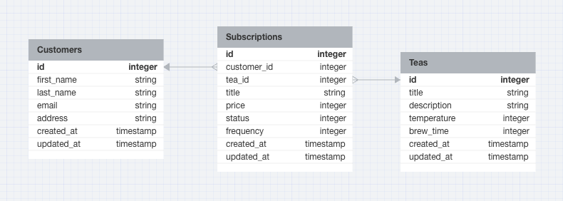

<a name="readme-top"></a>

[![Contributors][contributors-shield]][contributors-url]
[![Forks][forks-shield]][forks-url]
[![Stargazers][stars-shield]][stars-url]
[![Issues][issues-shield]][issues-url]
[![MIT License][license-shield]][license-url]

</div align="center">
  <h3 align="center">Tea Subscription Service</h3>

  <p align="center">
    <a href="https://github.com/brandenge/tea-subscription-service/issues">Report Bug</a>
    ·
    <a href="https://github.com/brandenge/tea-subscription-service/issues">Request Feature</a>
  </p>
</div>

<!-- TABLE OF CONTENTS -->
<details>
  <summary>Table of Contents</summary>
  <ol>
    <li>
      <a href="#about-the-project">About The Project</a>
      <ul>
        <li><a href="#built-with">Built With</a></li>
      </ul>
    </li>
    <li>
      <a href="#getting-started">Getting Started</a>
      <ul>
        <li><a href="#prerequisites">Prerequisites</a></li>
        <li><a href="#installation">Installation</a></li>
      </ul>
    </li>
    <li><a href="#database-schema">Database Schema</a></li>
    <li><a href="#endpoints">Endpoints</a></li>
    <li><a href="#testing">Testing</a></li>
    <li><a href="#license">License</a></li>
    <li><a href="#contact">Contact</a></li>
  </ol>
</details>

## About The Project

This project is a Ruby on Rails API for a tea subscription service where customers can subscribe to different kinds of teas. It exposes the 3 endpoints that return JSON formatted per the convention outlined by the [JSON API Specification](https://json-schema.org/).

A summary of the endpoints is as follows:

1) Subscriptions index - returning data for all of the subscriptions,
2) Activate (create) subscription
3) Cancel subscription

- [GitHub Repository][github-repo]

### Built With

- [![Ruby][ruby-shield]][ruby-url]
- [![Ruby on Rails][rails-shield]][rails-url]
- [![PostgreSQL][postgres-shield]][postgres-url]
- [![Postman][postman-shield]][postman-url]

<p align="right">(<a href="#readme-top">back to top</a>)</p>

## Getting Started

### Prerequisites

- Ruby version 2.7.2
- Rails version 7.0.6
- PostgreSQL version 14.8

### Installation

Run all commands from the application's root directory.

- Clone the repo with (for SSH): `git@github.com:brandenge/tea-subscription-service.git`
- Install Ruby gems with `bundle install`
- Create database, run migrations, and seed database with: `rails db:{drop,create,migrate,seed}`
- Start server with: `rails server`

<p align="right">(<a href="#readme-top">back to top</a>)</p>

## Database Schema



<p align="right">(<a href="#readme-top">back to top</a>)</p>

## Endpoints

API documentation is done using [Swagger](https://swagger.io/), following the [OpenAPI Specification](https://github.com/OAI/OpenAPI-Specification) from the [OpenAPI Initiative](https://www.openapis.org/). Responses are in JSON, following the [JSON API Specification](https://jsonapi.org/).

[API Documentation](https://app.swaggerhub.com/apis-docs/brandenge/tea-subscription-service/1.0.0)

<p align="right">(<a href="#readme-top">back to top</a>)</p>

## Testing

The test suite is built with the following gems and tools:

1) `rspec-rails` - RSpec test framework for Ruby
2) `simplecov` - SimpleCov for test coverage reports
3) `factory_bot_rails` - FactoryBot to replace fixtures and dynamically create sample data
4) `faker` - Faker to generate random data
5) `capybara` - Capybara to test HTTP responses
6) `shoulda-matchers` - For additional built-in test methods that extend RSpec and Capybara
7) Postman - for live endpoint testing

To run the RSpec test suite, navigate to the application's root directory and run:

```sh
bundle exec rspec
```

To open the full SimpleCov coverage report in your browser, navigate to the application's root directory and run:

```sh
open coverage/index.html
```

<p align="right">(<a href="#readme-top">back to top</a>)</p>

## Roadmap

Potential features, functionality, or refactors for the future:

- Add error handling and sad-path testing
- Add Swagger API documentation
- Additional endpoints for customers and teas
- Consume an API (such as the [Spoonacular API](https://spoonacular.com/food-api/docs)) for additional data

## License

Distributed under the MIT License. See `LICENSE.txt` for more information.

## Contact

- Branden Ge: [![LinkedIn][linkedin-shield]][branden-li-url] [![GitHub][github-shield]][branden-github-url]

<p align="right">(<a href="#readme-top">back to top</a>)</p>

[contributors-shield]: https://img.shields.io/github/contributors/brandenge/tea-subscription-service.svg?style=for-the-badge
[contributors-url]: https://github.com/brandenge/tea-subscription-service/graphs/contributors
[forks-shield]: https://img.shields.io/github/forks/brandenge/tea-subscription-service.svg?style=for-the-badge
[forks-url]: https://github.com/brandenge/tea-subscription-service/network/members
[stars-shield]: https://img.shields.io/github/stars/brandenge/tea-subscription-service.svg?style=for-the-badge
[stars-url]: https://github.com/brandenge/tea-subscription-service/stargazers
[issues-shield]: https://img.shields.io/github/issues/brandenge/tea-subscription-service.svg?style=for-the-badge
[issues-url]: https://github.com/brandenge/tea-subscription-service/issues
[license-shield]: https://img.shields.io/github/license/brandenge/tea-subscription-service.svg?style=for-the-badge
[license-url]: https://github.com/brandenge/tea-subscription-service/LICENSE.txt

[github-repo]: https://github.com/brandenge/tea-subscription-service

[ruby-shield]: https://img.shields.io/badge/Ruby-CC342D?style=for-the-badge&logo=ruby&logoColor=white
[ruby-url]: https://ruby-doc.org

[rails-shield]: https://img.shields.io/badge/Ruby_on_Rails-CC0000?style=for-the-badge&logo=rubyonrails&logoColor=white
[rails-url]: https://guides.rubyonrails.org/

[postgres-shield]: https://img.shields.io/badge/PostgreSQL-4169E1?style=for-the-badge&logo=postgresql&logoColor=white
[postgres-url]: https://www.postgresql.org/

[postman-shield]: https://img.shields.io/badge/Postman-FF6C37?style=for-the-badge&logo=postman&logoColor=white
[postman-url]: https://www.postman.com/

[linkedin-shield]: https://img.shields.io/badge/LinkedIn-0A66C2?style=for-the-badge&logo=linkedin&logoColor=white
[github-shield]: https://img.shields.io/badge/GitHub-181717?style=for-the-badge&logo=github&logoColor=white


[branden-li-url]: https://www.linkedin.com/in/brandenge/
[branden-github-url]: https://github.com/brandenge
